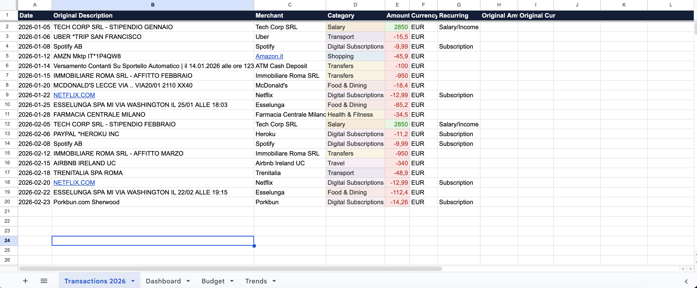
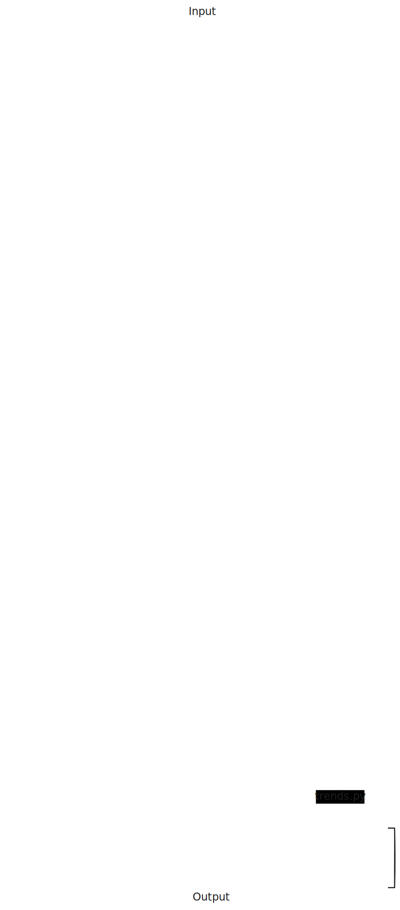

<p align="center">
  
</p>

<h1 align="center">Spectra</h1>
<p align="center">
  <strong>Bank CSV/PDF to AI categorization to Google Sheets</strong><br>
  Your personal finance dashboard, fully automated.
</p>

<p align="center">
  
  
  
</p>

<p align="center">
  
</p>

---

## What is Spectra?

Spectra takes your raw bank exports (CSV or PDF), sends them through an AI model (OpenAI or Gemini) to categorize every transaction, and builds a comprehensive, multi-tab financial dashboard on Google Sheets.

## Why Spectra exists

Most personal finance tools require direct access to your bank account or lock your data inside proprietary platforms.

Spectra takes a different approach: it works directly from standard bank exports (CSV or PDF), keeps everything transparent, and builds your dashboard in Google Sheets: a transparent, user-owned format you can export and extend.

### Core Features

- **Universal Import**: Auto-detects custom delimiters, edge-case bank layouts, Italian/European number formats (`1.234,56`), and multi-line descriptions from CSVs and PDFs. Drop a file in the `inbox/` folder and Spectra handles the rest.
- **AI Categorization**: Cleans obscure bank transfer descriptions into readable merchant names and accurately categorizes them using LLMs, distinguishing between Expenses (Shopping, Food, Transport) and Income (Salary, Transfers In).
- **Multi-Currency (FX Rates)**: If your bank export contains foreign currencies (USD, GBP, etc.), Spectra automatically calls the free [Frankfurter API](https://www.frankfurter.app/) to fetch the exact historical ECB exchange rate for that day, converting everything to EUR to keep your budgets and trends perfectly aligned. (Requires **zero API keys**).
- **Hybrid Recurring Detection**: Uses pattern-matching algorithms as a first pass, then falls back to analyzing historical dates in your local database. If an unknown transaction happens roughly ~30 days after an identical one, it is automatically flagged as a Subscription/Salary without relying on LLM guesses.
- **Smart Overrides (Feedback Loop)**: Spectra learns your habits. If the AI hallucinates a name or category, correct it directly in the new `Override` columns inside your Google Sheet. Spectra pulls these overrides on the next run, applying them instantly locally to save API tokens and time.
- **Idempotent**: Maintains a local SQLite database of transaction hashes. Spectra never imports the same transaction twice, even if you re-run the same CSV.
- **Fully Automated (Cron)**: Run it nightly via GitHub Actions. If you add a CSV to the `inbox`, the bot picks it up, updates your Google Sheet, and moves the file to `processed/`.
- **HTML Dry-Run Reporter**: Running `--dry-run` generates a beautiful offline HTML report mimicking a banking interface that opens in your browser, allowing you to review all AI categorizations before committing them to Sheets.

### Architecture / How it works

<p align="center">
  
</p>

### The Google Sheets Dashboard

Spectra automatically creates and formats multiple tabs:

1. **Dashboard**: High-level view for the current year. Shows Income vs Expenses, Spending donuts by category, monthly breakdowns, and recurring cash flow.
2. **Budget**: A dedicated tab where you define your monthly limits. Spectra checks these limits against your spending and displays a Live 🟢/🟡/🔴 Budget Status on the Dashboard.
   <p align="center"></p>

3. **Transactions YYYY**: A detailed, color-coded ledger for each year.
4. **Trends**: A Year-over-Year (YoY) comparison tab. Tracks your Net Cash Flow, Savings Rate %, and generates comparative multi-year line charts to visualize your trajectory.

---

## 🚀 Quick Start (Local)

1. **Clone the repository**
   ```bash
   git clone https://github.com/francescogabrieli/Spectra.git
   cd Spectra
   ```

2. **Install dependencies**
   ```bash
   python3 -m venv .venv
   source .venv/bin/activate
   pip install -r requirements.txt
   ```

3. **Configure the `.env` file** (See sections below for getting these keys)
   ```env
   BASE_CURRENCY=EUR
   AI_PROVIDER=openai
   OPENAI_API_KEY=sk-...
   SPREADSHEET_ID=1Do7APx...
   GOOGLE_SHEETS_CREDENTIALS_FILE=credentials.json
   ```

4. **Launch the Dashboard**
   ```bash
   python -m spectra --serve
   ```
   Open `http://localhost:8080` — upload CSVs, review categories, and confirm from the browser.

   <details>
   <summary>CLI alternative (advanced)</summary>

   ```bash
   # Process a folder of bank exports via CLI
   python -m spectra --inbox inbox/

   # Preview only (no writes) — useful for CI/CD or scripting
   python -m spectra --inbox inbox/ --dry-run
   ```
   </details>

---

## 🔌 Local Mode (No API Keys)

Spectra can run **fully offline** without any cloud AI. Set `AI_PROVIDER=local` in your `.env` and categorization happens entirely on your machine using a 6-step deterministic cascade:

1. **User Overrides**: Previously corrected categories from your Google Sheet
2. **Merchant Memory**: Exact match against merchants Spectra has seen before (stored in SQLite)
3. **Fuzzy Match**: Approximate matching (e.g., "STARBUCKS ROMA" matches "Starbucks") via `rapidfuzz`
4. **Keyword Rules**: ~50 built-in patterns covering Netflix, Spotify, Amazon, Uber, Trenitalia, supermarkets, insurance, utilities, and more
5. **ML Classifier** (optional): A lightweight TF-IDF + Logistic Regression model trained on *your* history. Install with `pip install scikit-learn` to enable
6. **Fallback**: Anything unmatched is labeled "Uncategorized" for you to correct in Sheets (Spectra remembers the correction next time)

> **Tip**: Run Spectra with `openai` or `gemini` first to build up your merchant memory. Then switch to `AI_PROVIDER=local` for zero-cost, zero-latency, fully private runs going forward!

---

## 🔑 Getting the Keys

### 1. Google Sheets API (`SPREADSHEET_ID` & `credentials.json`)

To allow Spectra to write to your Google Sheet without logging in every time, you need a "Service Account" (a bot user).

1. Go to the [Google Cloud Console](https://console.cloud.google.com/).
2. Create a new Project (e.g., "Spectra Finance").
3. In the top search bar, type **Google Sheets API** and click **Enable**.
4. Search for **Google Drive API** and click **Enable**.
5. Navigate to **APIs & Services > Credentials** in the left sidebar.
6. Click **Create Credentials > Service Account** at the top. Name it (e.g., "spectra-bot") and click **Done**.
7. In the list of Service Accounts, click the email address of the one you just created.
8. Go to the **Keys** tab, click **Add Key > Create new key**. Choose **JSON** and hit Create. The `credentials.json` file will download to your computer.
9. **CRITICAL**: Move this downloaded file into the root of your cloned `Spectra` folder and rename it exactly to `credentials.json`.
10. Open the `credentials.json` file in a text editor and copy the `"client_email"` address (it looks like `spectra-bot@spectra-finance.iam.gserviceaccount.com`).
11. Create a new blank Google Sheet on your personal Google Drive. 
12. Click the big **Share** button in the top right, paste the `client_email`, and give the bot **Editor** permissions.
13. Copy the long **Spreadsheet ID** from the URL of your new Google Sheet:  
    `https://docs.google.com/spreadsheets/d/`**`<THIS_LONG_STRING_IS_THE_SPREADSHEET_ID>`**`/edit`
14. Paste this ID into your `.env` file under `SPREADSHEET_ID`.

### 2. AI Provider (`OPENAI_API_KEY` or `GEMINI_API_KEY`)

Spectra supports **OpenAI** (ChatGPT) and **Google Gemini**. Gemini is highly recommended to start because it offers a very generous free tier.

**To use Google Gemini (Free Tier):**
1. Go to [Google AI Studio](https://aistudio.google.com/apikey).
2. Click **Create API Key**.
3. Copy the key and put it in your `.env` file as `GEMINI_API_KEY`.
4. Ensure your `.env` has `AI_PROVIDER=gemini`.

**To use OpenAI (Paid):**
1. Go to [OpenAI Platform](https://platform.openai.com/api-keys).
2. Click **Create new secret key**.
3. Copy the key and put it in your `.env` file as `OPENAI_API_KEY`.
4. Ensure your `.env` has `AI_PROVIDER=openai`.

---

## 🤖 GitHub Actions (Cloud Automation)

Spectra includes a workflow (`.github/workflows/spectra.yml`) that runs every night at 22:00 CET or manually via dispatch. Drop CSVs into the `inbox/` folder, commit to GitHub, and let the Action process them while you sleep.

### Setup GitHub Secrets

Go to your GitHub Repository homepage to **Settings to Secrets and variables to Actions**. Add the following **Repository Secrets**:

1. **`OPENAI_API_KEY`** or **`GEMINI_API_KEY`**: Your chosen AI key.
2. **`SPREADSHEET_ID`**: Your Google Sheet ID.
3. **`GOOGLE_SHEETS_CREDENTIALS_B64`**: The base64-encoded version of your `credentials.json`.
   
   To generate this string:
   * **macOS/Linux**: `base64 -i credentials.json | pbcopy` (copies the giant string to your clipboard)
   * **Windows (PowerShell)**: `[Convert]::ToBase64String([IO.File]::ReadAllBytes("credentials.json")) | clip`

When the action runs, it processes the `inbox/` folder. Processed files are moved to `processed/` and the changes are automatically committed back to the repository.

---

## 💻 CLI Usage

| Command | Description |
|---------|-------------|
| `python -m spectra --inbox inbox/` | **Recommended**: Processes all `.csv` and `.pdf` files inside the `inbox/` directory. Automatically moves successfully imported files to `processed/`. |
| `python -m spectra -f export.csv` | Process a single specific file. Does not move the file afterwards. |
| `--dry-run` | Appended to any command. Runs the parsing and AI categorization, prints the results to the terminal, but **skips** writing to Google Sheets and **skips** database saving. Great for testing. |
| `--currency USD` | Override the default `EUR` formatting. |

---

## 🔒 Privacy & Architecture

- **Local Processing First**: The heavy lifting (CSV parsing, description cleaning, deduplication) happens locally or in your private GitHub Action runner.
- **AI Payload**: Only the transaction date, cleaned description, and amount are sent to the AI Provider for categorization.
- **No Third-Party Plaid/OpenBanking**: Spectra does not connect directly to your bank account. You remain in complete control of your data exports.
- **Database**: The local `data/spectra.db` SQLite database stores **only cryptographic SHA1 hashes** of your transactions to prevent duplicates.
- **Execution**: Parsing/normalization/dedup run locally. Categorization uses OpenAI/Gemini depending on configuration.

## 📄 License

Spectra is licensed under the **GNU Affero General Public License v3.0 (AGPL-3.0)**.

This ensures that if you modify Spectra and run it as a network service (e.g. SaaS), you must also make the source code of your modifications available to users.

### Commercial License

A separate commercial license is available for organizations that want to use Spectra in a closed-source or proprietary product without AGPL obligations.

For commercial licensing inquiries, contact: francesco.gabrieli.fg@gmail.com
